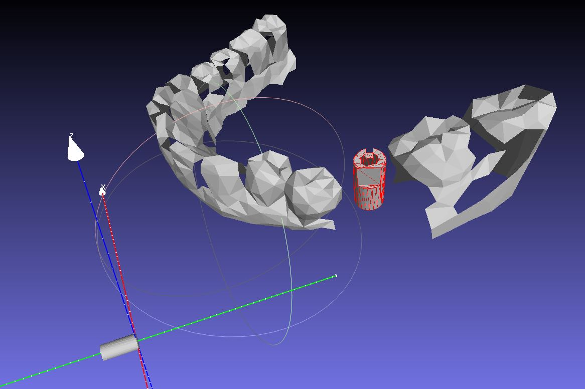

# 창의적 통합설계
## ./demo: Demo를 위한 자료 파일  
처음 잇몸의 면의 갯수가 250000개 정도 되서 다 돌리기에는 많은 수행시간이 요구될 것이라 예상되므로 decimation을 진행하여 1200개 정도까지 면의 갯수를 줄였습니다.  
- ./demo/model.stl: Model(잇몸 + 지주대)를 decimation 시킨 파일  
- ./demo/scene.stl: Scene(기준 지주대, 원점에 존재)를 decimation 시킨 파일  
- ./demo/result.stl: 최종변환행렬을 구하여 Scene에 적용시킨 파일, 결과 파일  
- ./demo/model_cn: Cennor.py에서 model을 읽기 위해서는 model.stl파일이 면의 중점과 면 벡터 튜플로 이루어진 구조여야한다. 이를 위해 MathLab을 이용하여 전처리 해 놓은 파일, 실제로 Cennor.py에서는 이 파일을 읽음.  
- ./demo/scene_cn: model_cn과 마찬가지로 scene에 대해 똑같이 적용해놓은 파일.  

## Cennor.py
./demo 폴더에 있는 자료를 읽어들여 transform matrix를 구하는 python script.
### Step 1.
 - Model 읽기  
### Step 2.
 - 읽은 Model로부터 PPF(Point Pair Feature) 계산 및 Hash table에 저장  
### Step 3.
 - Scene을 읽어 PPF를 계산하고 Hash table 속 Model의 PPF와 같은 값인 있는지 체크  
 - 같은 PPF를 가지는 Scene의 점 Pair(Sr, Si)와 Model의 점 (Mr, Mi)를 G(1, 0, 0)으로 회전 변환시키는  
 회전 변환 Tstog와 Tmtog 그리고 사이각 알파 계산
 - 알파 값을 key로 Tstog와 Tmtog 그리고 (Mr, Mi), (Sr, Si) 저장 및 voting 숫자 계산
### Step 4.
 - Voting된 결과로부터 투표를 가장 많이 받은 알파 값 선정
 - 선정된 알파 key에 저장된 Tstog와 Tmtog 그리고 (Mr, Mi), (Sr, Si)로부터 최종 변환 행렬 계산
### Step 5.
 - 최종 변환 행렬을 적용하여 답 비교
### Step 6.
 - 변환 값 저장
 
## module.py
 - Step 6를 위한 Stl파일 I/O
 
## transform.py
 - 변환 관련 함수들 모아놓은 Script

## 결론
 - 여러 물체들 속에서 동일한 메쉬 구조를 가지는 어떤 한 물체를 찾는 작업은 100% 확률로 찾을 수 있다.
 - 하지만, 메쉬구조가 달라지게 된다면 부정확한 결과를 나타내게 된다.

## 예제들

